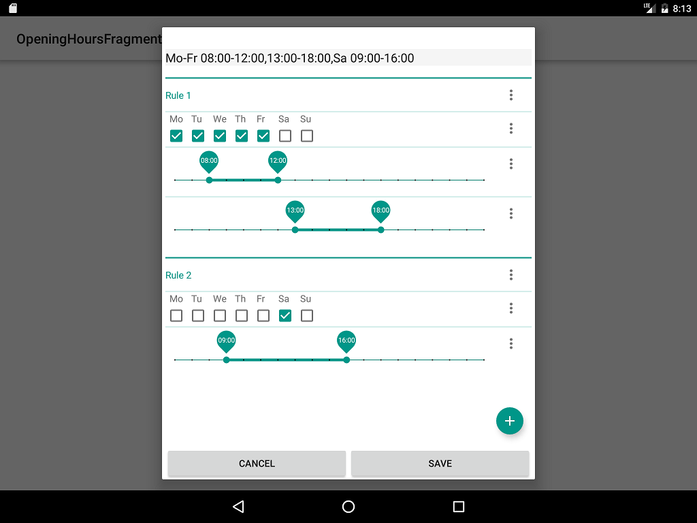

# OpeningHoursFragment

It is currently work in progress and not completed yet, see [UI todos](https://github.com/simonpoole/OpeningHoursFragment/issues/5), but the idea is to provide a re-usable UI element for editing opening hour values that covers the complete specification, instead of a broken, write only, subset.

