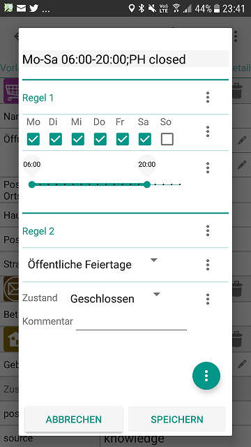

[](https://github.com/simonpoole/OpeningHoursFragment/actions) [](https://sonarcloud.io/dashboard?id=OpeningHoursFragment) [](https://sonarcloud.io/dashboard?id=OpeningHoursFragment) [](https://sonarcloud.io/component_measures?id=OpeningHoursFragment%3Alib&metric=bugs) [](https://sonarcloud.io/component_measures?id=OpeningHoursFragment%3Alib&metric=Maintainability) [](https://sonarcloud.io/component_measures?id=OpeningHoursFragment%3Alib&metric=Security) [](https://sonarcloud.io/component_measures?id=OpeningHoursFragment%3Alib&metric=Reliability)

# OpeningHoursFragment

This is a re-usable UI element for editing opening hour values that covers the complete specification, it is suitable for non-destructive editing (it will not overwrite or destroy valid opening hours values).



Please see the [end user documentation](lib/documentation/docs/help/en/Opening%20hours.md) for more information. 

## Usage

### From a FragmentActivity

``` java
    FragmentManager fm = getSupportFragmentManager();
    ...
	OpeningHoursFragment openingHoursDialog = OpeningHoursFragment.newInstance(key,finalValue, R.style.Theme_AppCompat_Light_Dialog_Alert, -1, true);
	openingHoursDialog.show(fm, "fragment_opening_hours");
```

The calling activity needs to implement ch.poole.openinghoursfragement.OnSaveListener which will be used when the user saves a OH value. Have a look at the test app for a working trivial example.

### From a Fragment

``` java
    FragmentManager fm = getChildFragmentManager();
    ...
	OpeningHoursFragment openingHoursDialog = OpeningHoursFragment.newInstanceForFragment(key,finalValue, R.style.Theme_AppCompat_Light_Dialog_Alert, -1, true);
	openingHoursDialog.show(fm, "fragment_opening_hours");
```

The calling Fragment needs to implement ch.poole.openinghoursfragement.OnSaveListener which will be used when the user saves a OH value. Have a look at the test app for a working trivial example.

For other variants please see the javadoc.

If you are overriding onActivityResult in the Activity calling the Fragment, you need to check that you calling through to super, or else loading and saving templates will fail silently. 

## Including in your project

Add the following to your *build.gradle* file(s):

``` groovy
repositories {
    maven {
    	mavenCentral()
    }
}
```

``` groovy
dependencies {
    compile "ch.poole:OpeningHoursFragment:0.13.2"
}
```
